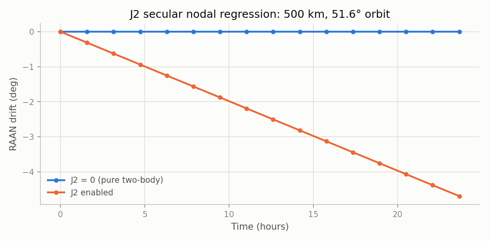
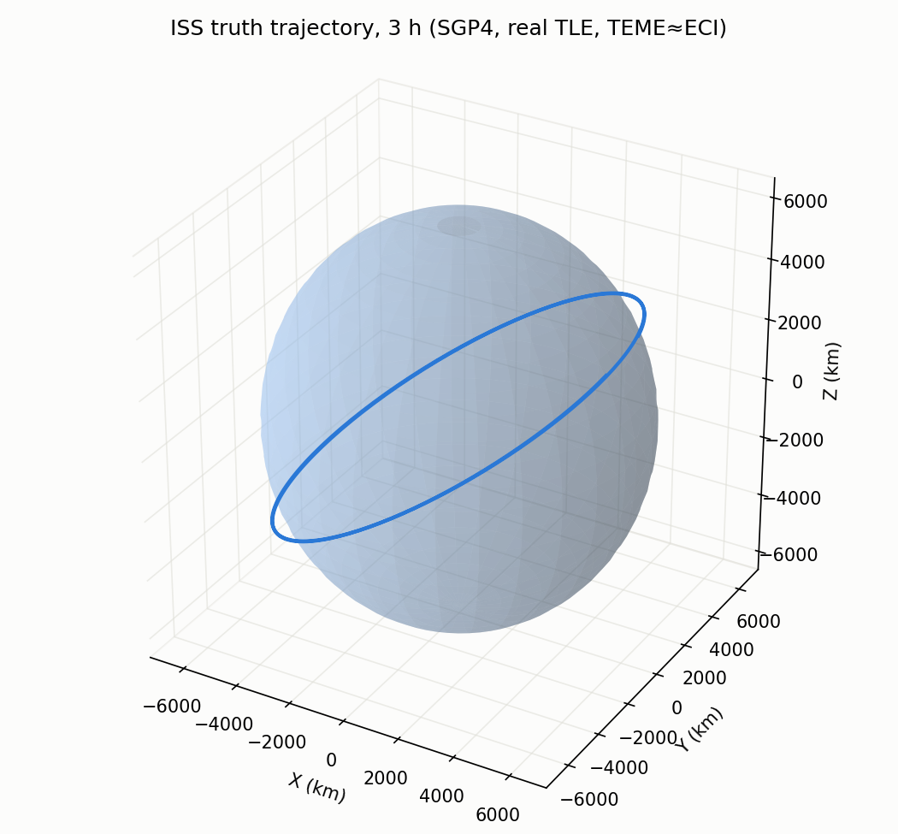
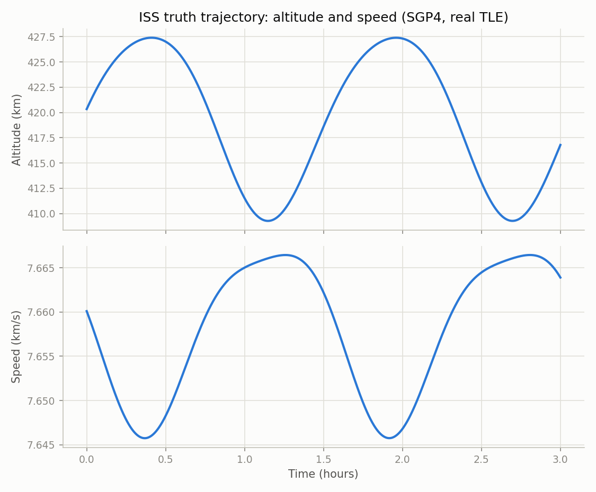
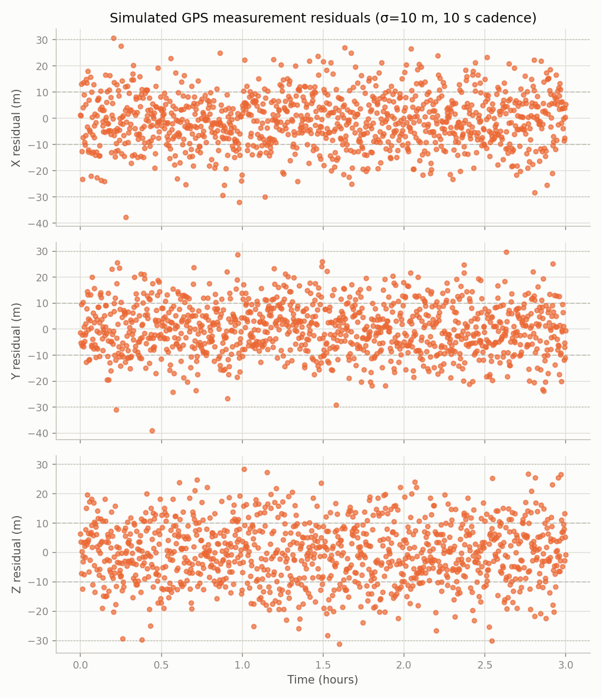
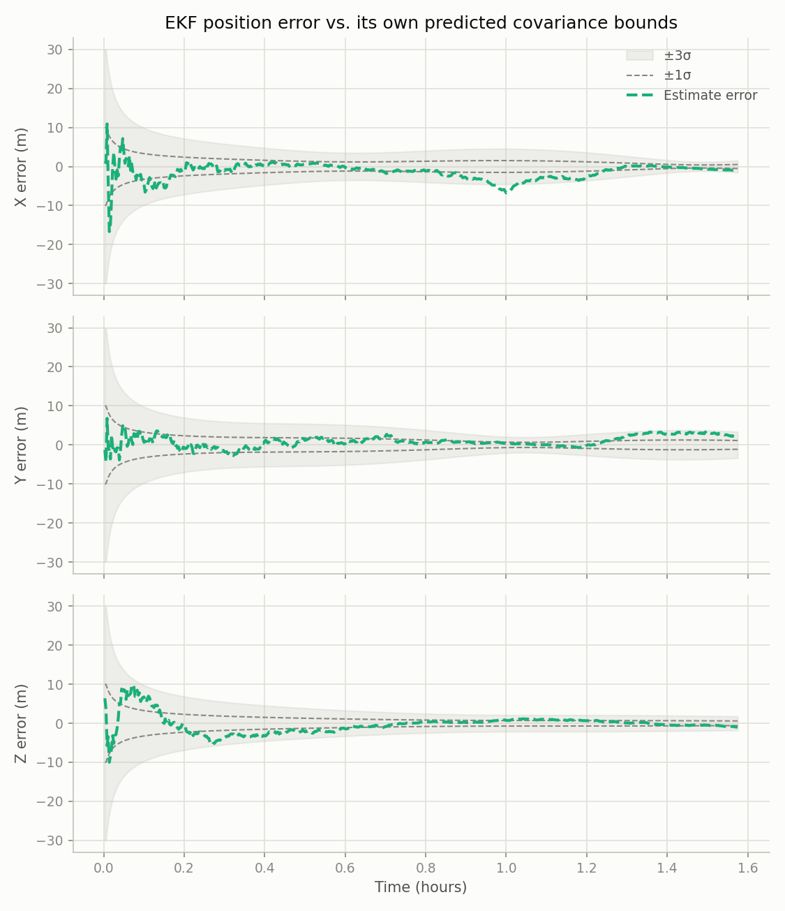

# Orbit Determination

A from-scratch orbit determination pipeline: two-body + J2 dynamics, a real
ISS trajectory (SGP4 from a live TLE) as ground truth, simulated noisy GPS
measurements, and a hand-rolled Extended Kalman Filter to recover position
and velocity in ECI. Built as a GNC portfolio project — the goal is correct
estimation theory and testing rigor, not just code that runs.

Strict SI units (meters, seconds) internally; every external unit (SGP4's
km, km/s) is converted at the module boundary.

## Setup

```bash
python3 -m venv .venv
source .venv/bin/activate
pip install -e ".[dev,truth,viz]"
```

## Run tests

```bash
.venv/bin/python -m pytest --cov=orbit_od --cov-report=term-missing
```

CI (GitHub Actions) runs `ruff` and the full test suite on Python 3.10-3.12
on every push — see the badge-worthy [Actions tab](../../actions).

## Project progress

Each milestone below is generated from working code via
[`docs/make_screenshots.py`](docs/make_screenshots.py) — the images are a
byproduct of the test suite, not hand-made mockups. Run
`.venv/bin/python docs/make_screenshots.py` to regenerate all of them in
one call before pushing, so a stale image from an earlier code version
never sits in the README after a later refactor.

Every plot draws from one shared style (`src/orbit_od/plotting.py`): a
fixed trajectory-plot canvas and a fixed time-series-plot canvas, and a
fixed series identity — truth is always a solid blue line, GPS
measurements are always unconnected orange markers, and (from Module 4 on)
the EKF estimate is always a dashed aqua line — so "truth" and
"measurement" mean the same thing in every module's screenshot.

### ✅ Module 1 — Dynamics (two-body + J2)
Validates the propagator against closed-form Kepler and analytical J2 RAAN drift.

Backed by: `tests/test_dynamics.py`

### ✅ Module 2 — Truth (SGP4 ISS ground truth)
Real ISS TLE propagated via SGP4, frozen offline for CI.


Backed by: `tests/test_truth.py`

### ✅ Module 3 — Measurements (simulated noisy GPS)
Per-axis measurement residual vs time, bounded by the simulator's own
±1σ/±3σ — a literal trajectory overlay can't show 10 m of noise against a
~7000 km orbit radius, so this plots the quantity that actually matters.

Backed by: `tests/test_measurements.py`

### ✅ Module 4 — EKF
The centerpiece screenshot: per-axis position estimate error against the
filter's own predicted ±1σ/±3σ covariance bounds, not just an
estimate-vs-truth line — a merely "close" estimate proves far less than
one whose error visibly stays inside the envelope the filter itself is
reporting. State transition matrix Φ_k is finite-difference (central
difference through the existing, already-tested `dynamics.propagate`,
not a separately-integrated variational equation); covariance update is
Joseph form. Seeded with +1 km position / +10 m/s velocity error,
converges to a few meters within the first few minutes of a ~95-minute
orbit.

Backed by: `tests/test_ekf.py`

### ⬜ Module 5 — Monte Carlo
Will show: consistency check across N runs (NEES/NIS statistics or an
error histogram vs. predicted covariance).

### ⬜ Module 6 — Final viz suite
Will show: a composite "mission summary" figure pulling from all prior
modules.

## Build order

1. ✅ Two-body + J2 propagator (`dynamics.py`)
2. ✅ SGP4 ground truth (`truth.py`)
3. ✅ Simulated noisy GPS measurements (`measurements.py`)
4. ✅ Hand-rolled EKF (`ekf.py`)
5. ⬜ Monte Carlo consistency verification (`scripts/run_monte_carlo.py`)
6. ⬜ Visualization suite (`scripts/plot_results.py`)
7. ⬜ CI/CD (✅ done early) & documentation of physical/estimation trade-offs

## Physical constants (`src/orbit_od/constants.py`)

| Constant | Value | Units | Source |
|---|---|---|---|
| `MU_EARTH` | `3.986004418e14` | m³/s² | WGS-84/EGM96 |
| `R_EARTH` | `6378137.0` | m | WGS-84 equatorial radius |
| `J2` | `1.08262668e-3` | dimensionless | WGS-84/EGM96 |
| `OMEGA_EARTH` | `7.2921150e-5` | rad/s | WGS-84 |

## EKF assumption: finite-difference Jacobian, not analytic

`ekf.py`'s state transition matrix Φ_k is built by central-differencing
the existing two-body+J2 propagator (perturb each of the 6 state
components, propagate x+δ and x-δ over the full step, difference the
results) rather than hand-deriving the analytic J2 acceleration
Jacobian and integrating the variational equation Φ̇ = FΦ alongside the
nonlinear state. Both are valid; finite-difference reuses code that's
already tested in Module 1 and carries far less bug surface than a
hand-derived Jacobian (a sign error there would silently degrade filter
performance rather than throwing an exception), at a small and
controllable accuracy cost via the perturbation step size. As an
independent correctness check, the resulting Φ_k is confirmed symplectic
(det = 1, as required for conservative two-body/J2 dynamics) to ~1e-10
in `test_ekf.py`.

`predict()` reserves a `jacobian_mode="analytic"` option (currently
`NotImplementedError`) for a future hand-derived J2 Jacobian — a good
portfolio detail to add later, validated against the finite-difference
Φ_k to a tight tolerance, but not on the critical path for a working,
tested filter.

## Frame assumption: TEME ≈ ECI

SGP4 natively outputs TEME (True Equator, Mean Equinox of date), not
J2000/GCRF. This project treats TEME as ECI without a precession/nutation
rotation — valid for the few-hour propagation windows used here, where the
resulting position error is well below the 5-15 m GPS measurement noise
the EKF is designed to handle. See `src/orbit_od/truth.py` for the full
rationale. A multi-day or higher-precision application would need an
explicit TEME→GCRF rotation.
