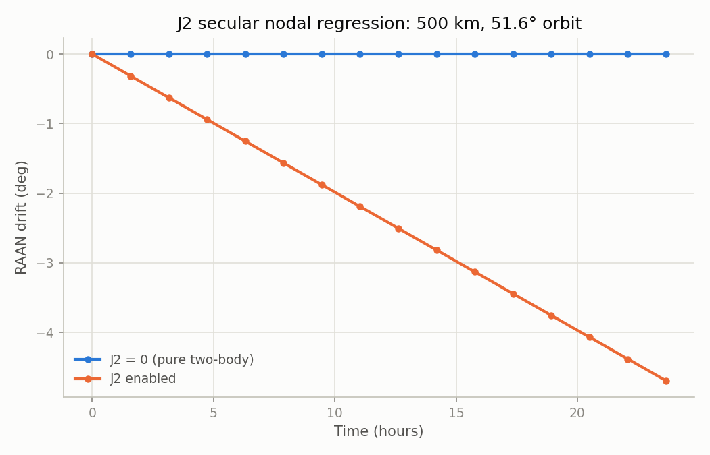
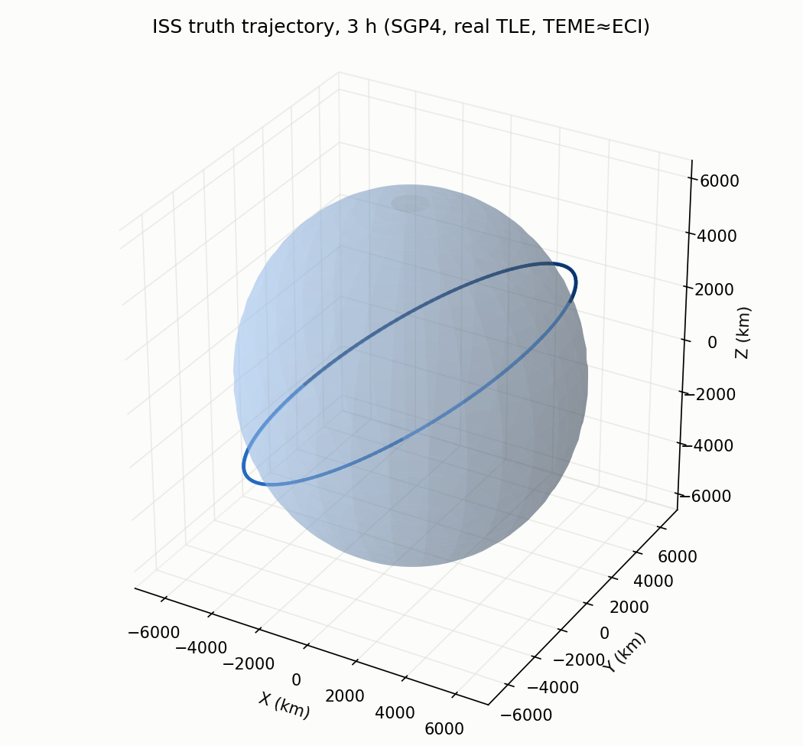
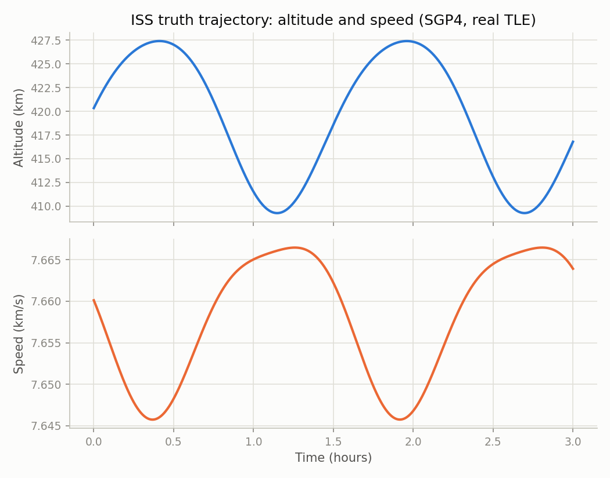

# Orbit Determination

A from-scratch orbit determination pipeline: two-body + J2 dynamics, a real
ISS trajectory (SGP4 from a live TLE) as ground truth, simulated noisy GPS
measurements, and a hand-rolled Extended Kalman Filter to recover position
and velocity in ECI. Built as a GNC portfolio project — the goal is correct
estimation theory and testing rigor, not just code that runs.

Strict SI units (meters, seconds) internally; every external unit (SGP4's
km, km/s) is converted at the module boundary.

## Setup

```bash
python3 -m venv .venv
source .venv/bin/activate
pip install -e ".[dev,truth,viz]"
```

## Run tests

```bash
.venv/bin/python -m pytest --cov=orbit_od --cov-report=term-missing
```

CI (GitHub Actions) runs `ruff` and the full test suite on Python 3.10-3.12
on every push — see the badge-worthy [Actions tab](../../actions).

## Project progress

Screenshots below are regenerated from current code by
[`docs/make_screenshots.py`](docs/make_screenshots.py) — they're a running
log of what's actually implemented and verified, not mockups. Each entry
corresponds to a module in the build order below.

**Module 1 — Two-body + J2 propagator** (`src/orbit_od/dynamics.py`)

RK45 propagation validated against closed-form Kepler (pure two-body) and
the analytical J2 secular nodal regression rate:



**Module 2 — SGP4 ground truth** (`src/orbit_od/truth.py`)

A real, checksum-valid ISS TLE (pulled live from Celestrak) propagated with
`sgp4`, converted from TEME/km to the project's ECI/meters convention:




## Build order

1. ✅ Two-body + J2 propagator (`dynamics.py`)
2. ✅ SGP4 ground truth (`truth.py`)
3. ⬜ Simulated noisy GPS measurements (`measurements.py`)
4. ⬜ Hand-rolled EKF (`ekf.py`)
5. ⬜ Monte Carlo consistency verification (`scripts/run_monte_carlo.py`)
6. ⬜ Visualization suite (`scripts/plot_results.py`)
7. ⬜ CI/CD (✅ done early) & documentation of physical/estimation trade-offs

## Physical constants (`src/orbit_od/constants.py`)

| Constant | Value | Units | Source |
|---|---|---|---|
| `MU_EARTH` | `3.986004418e14` | m³/s² | WGS-84/EGM96 |
| `R_EARTH` | `6378137.0` | m | WGS-84 equatorial radius |
| `J2` | `1.08262668e-3` | dimensionless | WGS-84/EGM96 |
| `OMEGA_EARTH` | `7.2921150e-5` | rad/s | WGS-84 |

## Frame assumption: TEME ≈ ECI

SGP4 natively outputs TEME (True Equator, Mean Equinox of date), not
J2000/GCRF. This project treats TEME as ECI without a precession/nutation
rotation — valid for the few-hour propagation windows used here, where the
resulting position error is well below the 5-15 m GPS measurement noise
the EKF is designed to handle. See `src/orbit_od/truth.py` for the full
rationale. A multi-day or higher-precision application would need an
explicit TEME→GCRF rotation.
